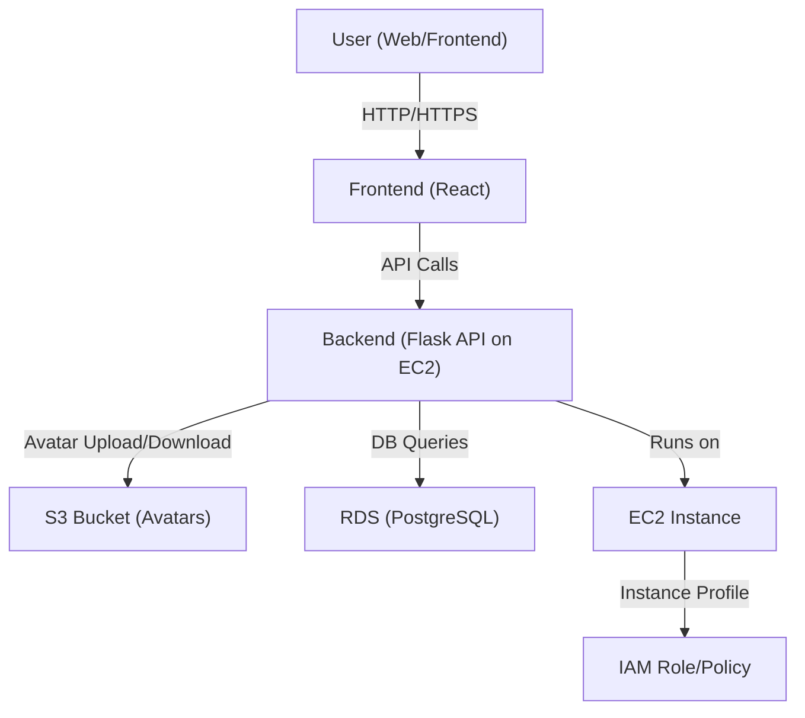

# 🟧 AWS Architecture & Deployment Guide

> **Note:** All general installation and setup instructions (Python, dependencies, database, environment variables, etc.) are provided in the main `README.md` file. This document focuses exclusively on AWS architecture, configuration, and deployment for this project.

## 1. Key AWS Services Used

| Service         | Purpose in Architecture                                                                 |
|-----------------|----------------------------------------------------------------------------------------|
| **EC2**         | Hosts the backend Flask API and (optionally) the frontend. Managed via Terraform.      |
| **S3**          | Stores user avatar images for scalable, durable, and fast access.                      |
| **RDS**         | (Optional/Planned) For production-grade PostgreSQL database hosting.                   |
| **IAM**         | (Implied) Used for secure access to S3 and EC2 via roles and user credentials.         |
| **VPC**         | (Default) EC2 and RDS are launched within a VPC for network isolation and security.    |
| **Security Groups** | Control inbound/outbound traffic to EC2 (HTTP, SSH). Managed via Terraform.        |

---

## 2. AWS Configuration Details

### EC2
- **Provisioned via Terraform** (`infrastructure/main.tf`)
- **AMI**: Default Amazon Linux 2 (modifiable via `variables.tf`)
- **Instance Type**: `t2.micro` (modifiable)
- **Key Pair**: For SSH access, set in `variables.tf`
- **Security Group**: Allows HTTP (80) from anywhere, SSH (22) from your IP only

### S3
- **Bucket**: Used for storing user avatars (`grocerymate-avatars`)
- **Access**: Via `boto3` in backend, using environment credentials or EC2 role
- **Configuration**: Controlled by `USE_S3_STORAGE`, `S3_BUCKET_NAME`, `S3_REGION` env vars

### RDS (Optional/Planned)
- **Connection**: Detected by backend via `POSTGRES_URI` containing `rds.amazonaws.com`
- **Migration**: Managed by Flask-Migrate, skips local migration if using RDS

### IAM
- **Roles/Policies**: Not explicitly defined in Terraform, but required for:
  - EC2 instance profile (to allow S3 access without hardcoded keys)
  - User credentials for local development

### VPC
- **Default VPC**: Used unless custom VPC/subnets are defined (not present in current Terraform)
- **Security**: Security group restricts access as above

---

## 3. Example: How Services Interact



**Example Flow:**
- User uploads an avatar via the frontend.
- Frontend sends the file to the backend API (hosted on EC2).
- Backend uses `boto3` to upload the file to S3 (using IAM credentials).
- Avatar URL is stored in the database (RDS or local Postgres).
- When needed, backend fetches the avatar from S3 and serves it to the frontend.

---

## 4. Step-by-Step AWS Deployment (with Terraform)

### Prerequisites
- AWS CLI configured (`aws configure`)
- Terraform installed
- SSH key pair created in AWS

### 1. Clone the Repo & Switch to Dev Branch
```sh
git clone git@github.com:margarita-moeslein/AWS_grocery.git
cd AWS_grocery/infrastructure
git checkout dev
```

### 2. Edit Variables (Optional)
Edit `variables.tf` to set your region, key pair, instance type, etc.

### 3. Initialize Terraform
```sh
terraform init
```

### 4. Plan and Apply
```sh
terraform plan
terraform apply
```
- This will create:
  - EC2 instance (with HTTP/SSH access)
  - Security group
  - (Optionally) S3 bucket (uncomment in `main.tf` if needed)

### 5. Deploy Backend
- SSH into your EC2 instance:
  ```sh
  ssh -i <your-key.pem> ec2-user@<instance-public-ip>
  ```
- Install Docker/Python, clone repo, set up `.env`, and run the backend as per main README.

### 6. S3 Setup
- Create the S3 bucket manually or via Terraform (uncomment the resource in `main.tf`).
- Set bucket name and region in your `.env` file.

### 7. (Optional) RDS Setup
- Create a PostgreSQL RDS instance via AWS Console or Terraform.
- Update `POSTGRES_URI` in `.env` to point to your RDS endpoint.

---

## 5. Key Points & Lessons Learned

- **Fast Learner**: Quickly adapted to AWS best practices (IAM, S3, EC2, Terraform).
- **Adaptability**: Switched between local and cloud environments seamlessly.
- **Security Awareness**: Used security groups, IAM roles, and avoided hardcoding secrets.
- **Automation**: Leveraged Terraform for reproducible infrastructure.
- **Debugging**: Handled S3/EC2 integration issues, credential management, and network/firewall troubleshooting.
- **Documentation**: Ensured all steps and configs are clearly documented for future maintainers.

---

## 6. Resources

- [Terraform AWS Provider Docs](https://registry.terraform.io/providers/hashicorp/aws/latest/docs)
- [AWS EC2 User Guide](https://docs.aws.amazon.com/ec2/)
- [AWS S3 User Guide](https://docs.aws.amazon.com/s3/)
- [AWS RDS User Guide](https://docs.aws.amazon.com/rds/)
- [boto3 Documentation](https://boto3.amazonaws.com/v1/documentation/api/latest/index.html)

---
